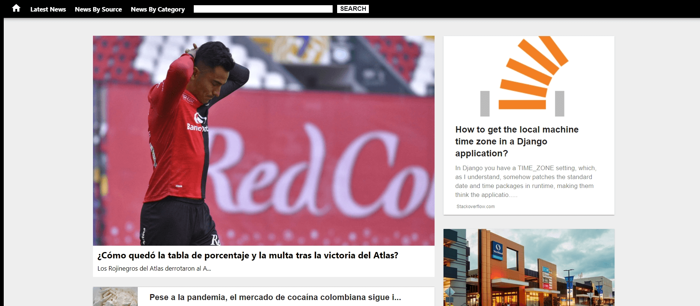
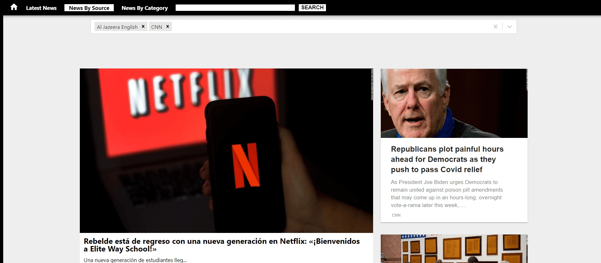

# Newsday
## simple news web application

  Newsday is a news website where user can update themselves with all the latest news around the globe. User can filter news based on the channels and can even select the categories of news according to their preferences. Searching of news with respect to user's query is also available in this website.
 

 
 ## Tech Stack used:

<code></code>
<code></code>
<code></code>
<code></code>
<code></code>
<code></code>

### Installation and Setup Instructions

Clone this repository. 
You will need node and npm installed globally on your machine.
Installation: npm install To install dependencies
Run:npm run start to run the App
App runs on port 3000

## <code>Sneak Peak</code>

## <code>News By Source Page</code>

## <code>Search</code>

## Contributors

<h3>Shamsher Ali</h3>👨‍- <a href="https://github.com/syedshamsher" >Shamsher</a>

NewsAPI is used for getting all the datas from the server. For further information go to : <a href="https://newsapi.org/" >NewsAPI</a> 

<h4>I take all the responsiblity for every single line of code.</h4>
